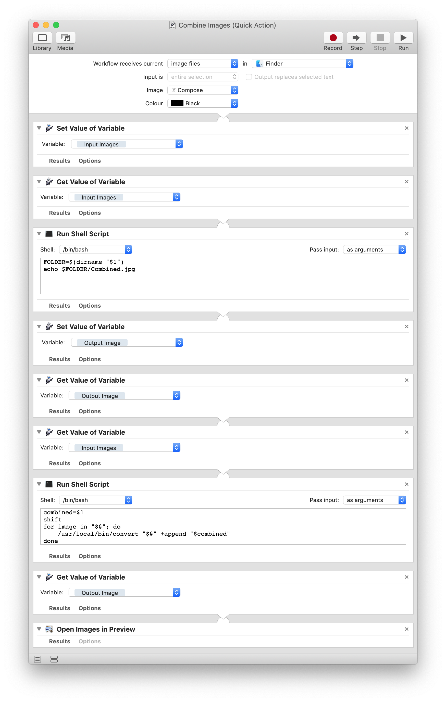

# Combine Images

How many times to took a lot of screenshots and you want to present them all in once?
You have to manually stitch them together via Photoshop or other softwares.

Now NO MORE! With this Automator script it is as easy as selecting your photos and running the "Combine Images" service.

## Requirements

This script is dependent on:

* [ImageMagic](http://www.imagemagick.org/script/index.php): it processes the images.
* Mac OS: if you want to use it as a service

## Installing

1. Download the script from the repo
2. Copy the Automator script `Combine Images.workflow` inside `~/Library/Services`

That should be it.

